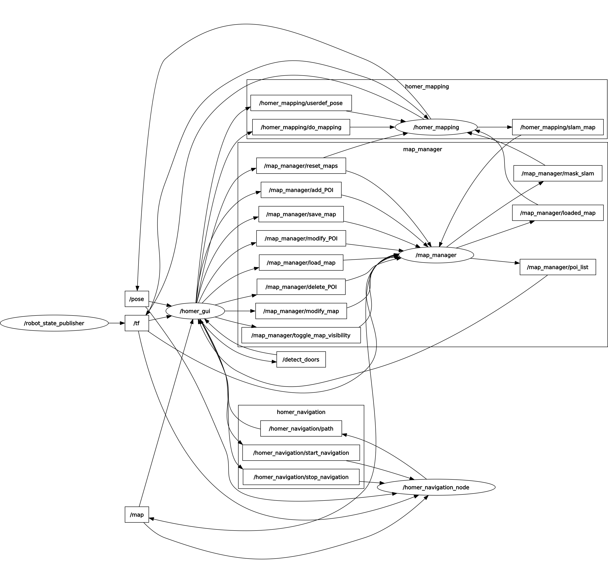

# map_manager

## Known Issues / Todo's 

Aus bisher ungeklärten Gründen kann es in seltenen Fällen passieren, dass der map_manager die Verbindung zum roscore verliert. In diesem Fall muss er durch rosrun map_manager map_manager neugestartet werden.

## Introduction 

Der map_manager ist der Mittelpunkt der Kommunikation zwischen homer_mapping, homer_navigation, GUI und die Spiel-Nodes.
Das Zusammenspiel dieser Nodes ist im Screenshot des rqt_graphs zu sehen.

Er verwaltet die aktuell durch das mapping erstellte Karte sowie weitere Kartebenen. Aktuell sind das die SLAM-Karte, die aktuellen Laserdaten in einer weiteren Ebene und eine Masking-Ebene, in der mit Hilfe der GUI Hindernisse oder freie Flächen in die Karte gezeichnet werden können.
Jedes mal, wenn eine SLAM-Karte von der mapping-Node geschickt wird, wird diese mit allen anderen Karteneben überschrieben (in der Reihenfolge SLAM, Masking, Laserdaten) und als eine zusammengefügte Karte versendet.
Zudem verwaltet der map_manager alle erstellten Points Of Interest (POIs), die z.B. als Ziele für die Navigation verwendet werden.
Die Node ist außerdem zuständig für das Speichern und Laden der Kartenebenen und der POIs. Dabei wird die SLAM-Ebene sowie die Masking-Ebene berücksichtigt.

## Topics 

#### Publisher 
* `/map`: Die aktuelle Karte, die aus allen aktivierten Kartenebenen zusammengesetzt ist. Diese wird in der GUI angezeigt und für die Navigation verwendet.
* `/map_manager/poi_list`: Verschickt einen Vektor mit allen aktuellen POIs. Dieser Publisher wird immer ausgelöst, sobald sich ein POI ändert oder ein neuer hinzugefügt wird.
* `/map_manager/loaded_map`: Wenn eine Karte geladen wird, wird über dieses Topic die geladene SLAM-Ebene an die homer_mapping-Node verschickt.
* `/map_manager/mask_slam`: Über die GUI kann die SLAM-Map verändert werden. Diese Modifizierungen werden über dieses Topic vom map_manager an das homer_mapping versendet.

#### Subscriber

* `/homer_mapping/slam_map (nav_msgs/OccupancyGrid)`: Hierüber wird die aktuelle SLAM-Map empfangen.
* `/map_manager/save_map (map_messages/SaveMap)`: Hierüber wird der Befehl zum Speichern der Karte inklusive des Dateinamens empfangen.
* `/map_manager/load_map (map_messages/SaveMap)`: Hiermit wird eine Karte geladen und alle bisherigen Kartenebenen durch die geladenen ersetzt.
* `/map_manager/toggle_map_visibility (map_messages/MapLayers)`: Hierüber können einzelne Kartenebenen aktiviert beziehungsweise deaktiviert werden. Deaktivierte werden nicht mehr beim Zusammenfügen der Karte berücksichtigt und dementsprechend auch nicht in der GUI angezeigt sowie für die Navigation verwendet.
* `/scan (nav_msgs/LaserScan)`: Der aktuelle Laserscan, der in die Laserscan-Ebene gezeichnet wird.
* `/map_manager/add_POI (map_messages/PointOfInterest)`: Hierüber kann ein POI hinzugefügt werden.
* `/map_manager/modify_POI (map_messages/ModifyPOI)`: Hierüber kann ein vorhandener POI verändert werden (Name, Position,...)
* `/map_manager/delete_POI (map_messages/DeletePointOfInterest)`: Hierüber kann ein vorhander POI gelöscht werden.
* `/map_manager/modify_map (map_messages/ModifyMap)`: Über dieses Topic werden die Koordinaten der Polygone verschickt, die über die GUI maskiert wurden. Außerdem wird die Kartenebene mitgeteilt, die verändet werden soll (SLAM oder Masking-Ebene).
* `/map_manager/reset_maps (std_msgs/Empty)`: Hierüber werden alle Kartenebenen zurückgesetzt.